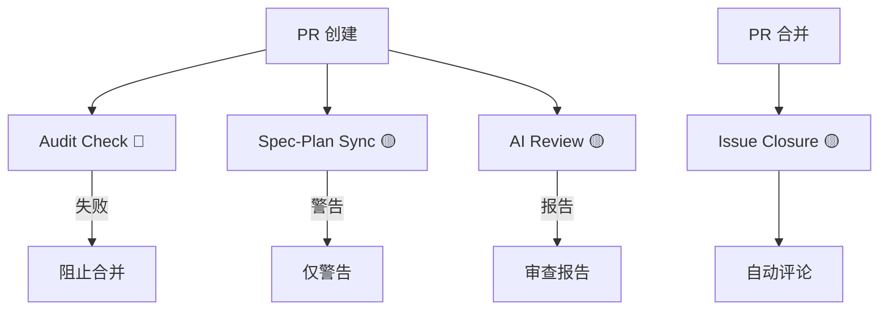

# GitHub Actions 工作流详细说明

本文档详细描述项目中所有 GitHub Actions 工作流的配置、触发条件、执行逻辑和故障排查。

---

## 📋 工作流清单

### 工作流概览

| 工作流 | 文件 | 类型 | 触发条件 | 功能 |
|--------|------|------|----------|------|
| **审计日志检查** | `audit_check.yml` | 🔴 强制 | PR 创建/更新 | 检查代码变更是否包含审计日志 |
| **Issue 知识闭环** | `close_loop.yml` | 🟡 建议 | PR 合并到 main | 在关联 Issue 自动发表评论 |
| **AI 代码审查** | `ai_review.yml` | 🟡 建议 | PR 创建/更新 | 生成代码审查报告 + 风险评级 |
| **Spec/Plan 同步检查** | `spec_plan_sync.yml` | 🟡 建议 | PR 创建/更新 | 检查 Spec/Plan 文档是否同步 |

---

## 🔴 强制工作流

### 1. Audit Log Integrity Guard (`audit_check.yml`)

**触发条件**：
```yaml
on:
  pull_request:
    types: [opened, synchronize, reopened]
```

**执行逻辑**：
1. 检出代码（`fetch-depth: 0` 获取完整历史）
2. 提取除文档和配置外的所有代码变更文件
3. 如果有代码变更，检查 `.gemini/ops_changelog.md` 是否在变更中
4. 如果没有审计日志，退出并报错

**检查范围**：
- **排除目录**：`.github/`, `openspec/`, `README.md`, `ARCHITECTURE.md`, `GETTING_STARTED.md`, `docs/`
- **检查文件**：`.gemini/ops_changelog.md`

**失败示例**：
```
❌ **物理熔断**: 检测到代码变更，但未在 .gemini/ops_changelog.md 中提交审计日志！
请记录变更意图与 Undo_CMD。
```

**通过示例**：
```
✅ **合规**: 操作审计记录已存在。
```

**合规要求**：
任何代码变更都必须在 `.gemini/ops_changelog.md` 中记录：
```markdown
| Time | Action | Target | Reason | Commit_ID | Undo_CMD |
| :--- | :--- | :--- | :--- | :--- | :--- |
| 2026-04-07 | UPDATE | src/scrapers/linuxdo.js | 优化页面加载策略 | pending | git checkout src/scrapers/linuxdo.js |
```

---

## 🟡 建议性工作流

### 2. Issue Knowledge Closure (`close_loop.yml`)

**触发条件**：
```yaml
on:
  pull_request:
    types: [closed]
    branches: [main]
```

**执行条件**：
仅当 PR 被合并时执行（`if: github.event.pull_request.merged == true`）

**执行逻辑**：
1. 提取 PR 描述中的 Issue 关联（支持 `Closes #N`、`Fixes #N`、`Resolves #N`）
2. 提取 PR 描述中的变更摘要（`## 🚀 变更摘要 (Summary)` 章节）
3. 在关联 Issue 自动发表评论

**评论内容**：
```markdown
### ✅ 任务完成与知识沉淀 (SOP 2.0)
本项目已成功合并！本次协作产生的智力资产已归档。

- **📚 技术归档**: [查看 docs/superpowers/ 目录](链接)
- **🛠 核心变更摘要**:
  [变更摘要内容]

---
*Generated by YOU-DRIVE-SOP Engine (GitHub Actions)*
```

**注意事项**：
- 如果 PR 描述中没有数字 Issue ID，评论将发表在 PR 本身
- 需要 PR 描述中包含 `Closes #N` 等关键词才能正确关联

---

### 3. AI Code Review Assistant (`ai_review.yml`)

**触发条件**：
```yaml
on:
  pull_request:
    types: [opened, synchronize, reopened]
    branches: [main]
```

**权限**：
```yaml
permissions:
  contents: read
  pull-requests: write
```

**执行逻辑**：

#### Step 1: 生成变更统计
```bash
git diff origin/${{ github.base_ref }}...HEAD --stat
```

#### Step 2: 核心变更分析
提取除文档外的代码变更，生成表格：
| 文件 | 类型 | 风险等级 |
|------|------|----------|
| `src/scrapers/linuxdo.js` | JavaScript | 🟢 Low |
| `src/config/products/kimi.config.js` | Configuration | 🟡 Medium |
| `src/utils/auth.js` | JavaScript | 🔴 High |

**风险评级规则**：
- 🟢 Low：普通业务逻辑
- 🟡 Medium：配置文件、服务层变更
- 🔴 High：认证、安全、加密相关

#### Step 3: 测试覆盖检查
检查是否有测试文件变更（`test/`, `tests/`, `.test.`, `.spec.`）

#### Step 4: SOP 合规检查
- 提取 Issue ID（从 PR 描述或分支名）
- 检查审计日志是否更新

**输出**：
自动在 PR 发表评论，包含：
- 变更统计
- 核心变更分析表格
- 测试覆盖情况
- SOP 合规状态

---

### 4. Spec-Plan Sync Check (`spec_plan_sync.yml`)

**触发条件**：
```yaml
on:
  pull_request:
    types: [opened, synchronize, reopened]
    branches: [main]
```

**执行逻辑**：

#### Step 1: 提取 Issue ID
从 PR 描述或分支名提取 Issue ID

#### Step 2: 检查 Spec/Plan 文档
- 检查 `docs/superpowers/specs/*<ID>*` 是否存在
- 检查 `docs/superpowers/plans/*<ID>*` 是否存在

#### Step 3: 输出检查结果
- ✅ 检测到 Spec 文档
- ✅ 检测到 Plan 文档
- ⚠️ 建议：为核心功能变更补充 Spec 文档

**注意事项**：
- 此工作流仅输出警告，**不阻止合并**
- 对于 Feature 类型 PR，强烈建议补充 Spec/Plan 文档

---

## 🔧 工作流依赖关系



**图例**：
- 🔴 **强制**：检查失败将阻止合并
- 🟡 **建议**：仅输出报告/警告，不阻止合并

---

## 🚨 常见问题排查

### Q1: 审计日志检查失败

**错误信息**：
```
❌ **物理熔断**: 检测到代码变更，但未在 .gemini/ops_changelog.md 中提交审计日志！
```

**原因**：
代码变更但忘记更新审计日志

**解决方案**：
```bash
# 1. 编辑审计日志
nano .gemini/ops_changelog.md

# 2. 添加变更记录
| 2026-04-07 | UPDATE | src/scrapers/linuxdo.js | 优化页面加载策略 | pending | git checkout src/scrapers/linuxdo.js |

# 3. 提交更新
git add .gemini/ops_changelog.md
git commit -m "chore: 更新审计日志"
git push
```

---

### Q2: Issue 没有自动关闭

**原因**：
PR 描述中没有包含正确的关键词（`Closes #N`、`Fixes #N`、`Resolves #N`）

**解决方案**：
- 创建 PR 时确保描述中包含 `Closes #N`
- 或者手动关闭 Issue：`gh issue close <number>`

---

### Q3: AI 审查报告没有发表

**可能原因**：
- `thollander/actions-comment-pull-request@v2` Action 权限不足
- PR 描述格式异常，无法提取 Issue ID

**解决方案**：
- 检查 GitHub App 权限（需要 `pull-requests: write`）
- 确保 PR 描述包含标准章节

---

### Q4: Spec/Plan 同步检查警告

**警告信息**：
```
⚠️ 建议：为核心功能变更补充 Spec 文档
```

**原因**：
代码变更但未检测到对应的 Spec/Plan 文档

**解决方案**：
- **强烈建议补充**：使用 Superpowers 工作流生成文档
  ```bash
  /brainstorming  # 探索方案，生成 Spec
  /writing-plans  # 生成实施计划
  ```
- **可忽略**：如果是小型修复或重构

---

## ⚙️ 配置说明

### 必需的环境变量

无（所有工作流使用默认配置）

### 可选配置

如需调整工作流行为，可修改：
- `.github/workflows/*.yml` - 工作流定义
- `.github/CODEOWNERS` - 代码评审规则

---

## 📈 持续改进

工作流会根据项目演进持续优化，欢迎提交 Issue 提出改进建议。

### 计划中的优化（Phase 2）

- [ ] 添加 `npm test` 到 CI 流程（强制测试通过）
- [ ] 对于 Feature PR，强制检查 Spec/Plan 文档
- [ ] 添加备份 CODEOWNERS（避免单点瓶颈）
- [ ] 合并重复的 workflows 减少计算资源

---

*最后更新: 2026-04-07*
