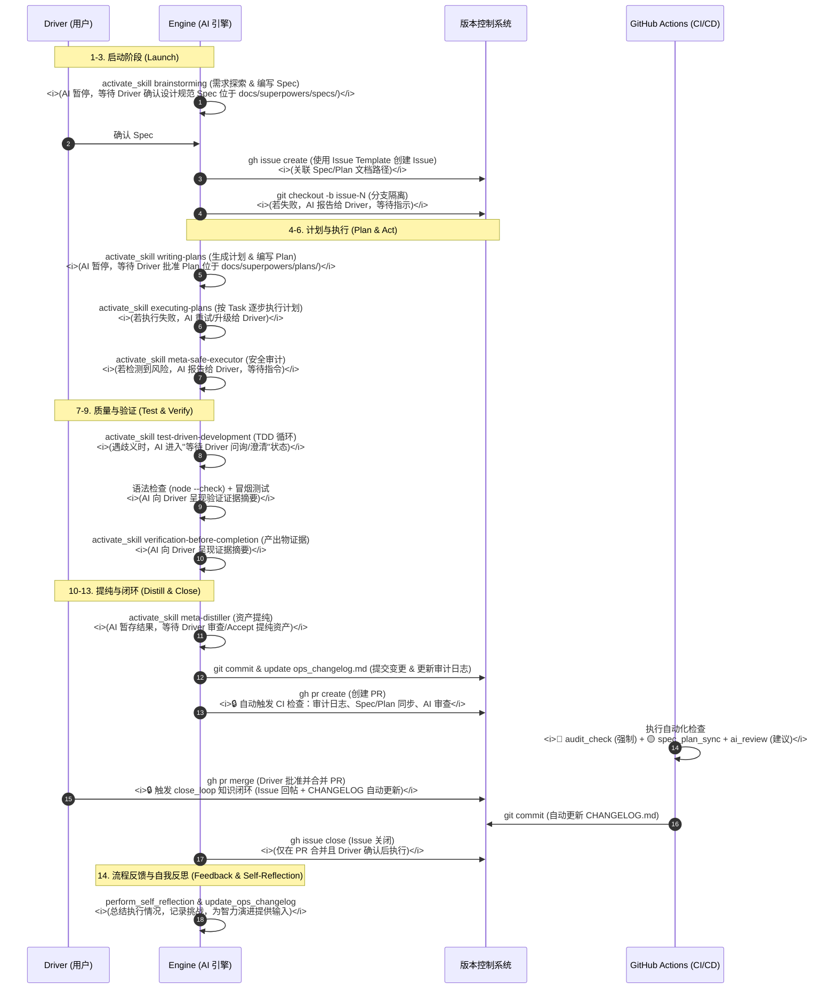

## 开发、生产生命周期

描述一个任务从需求探索到代码合并的全流程物理轨迹，深度融合 Superpowers 以确保工程质量，并明确人机交互与错误处理。



---

# 人机交互规范 (Human-in-the-Loop Standards)

### 1. AI 暂停点 (AI Pause Points)

在以下关键节点，AI 必须暂停并等待 Driver 确认：

| 阶段     | 暂停点              | 等待内容                                                |
| -------- | ------------------- | ------------------------------------------------------- |
| **启动** | `brainstorming` 后  | Driver 确认初步方案                                     |
| **设计** | `brainstorming` 后  | Driver 确认设计规范 Spec (位于 docs/superpowers/specs/) |
| **计划** | `writing-plans` 后  | Driver 批准 Plan (位于 docs/superpowers/plans/)         |
| **执行** | 遇到风险操作        | Driver 指令（如破坏性变更）                             |
| **验证** | 测试失败/歧义       | Driver 澄清或调整预期                                   |
| **提纯** | `meta-distiller` 后 | Driver 审查资产                                         |
| **闭环** | 合并请求创建后      | Driver 合并确认                                         |

### 2. AI 升级条件 (Escalation Conditions)

当遇到以下情况时，AI 应将问题升级给 Driver：

- **执行失败**：`executing-plans` 连续失败 3 次以上。
- **风险检测**：`meta-safe-executor` 检测到高风险操作（如数据迁移、核心逻辑重构）。
- **歧义阻塞**：TDD 测试中发现需求歧义，无法继续。
- **资源不足**：需要外部 API 密钥、设计资源或跨团队协调。

### 3. 证据呈现规范 (Evidence Presentation)

AI 在 `verification-before-completion` 阶段必须呈现以下证据：

```markdown
### 验证证据

- [ ] 单元测试通过率：X/Y
- [ ] 手动测试截图/录屏：[附件]
- [ ] 性能对比：优化前后数据
- [ ] 兼容性测试：相关平台/环境
```

---

# Issue 创建最佳实践

**⚠️ Windows 环境注意**：使用 `gh issue create` 时，**必须使用 `--body-file` 参数**，避免 `--body "文本"` 导致 Markdown 内容丢失。

```bash
# ✅ 正确方式：使用临时文件
echo "## 📋 需求描述..." > temp_body.md
gh issue create --title "标题" --body-file temp_body.md --label "enhancement"
del temp_body.md

# ❌ 错误方式：Windows 下 Markdown 内容会丢失
gh issue create --title "标题" --body "## 内容..."
```

---
