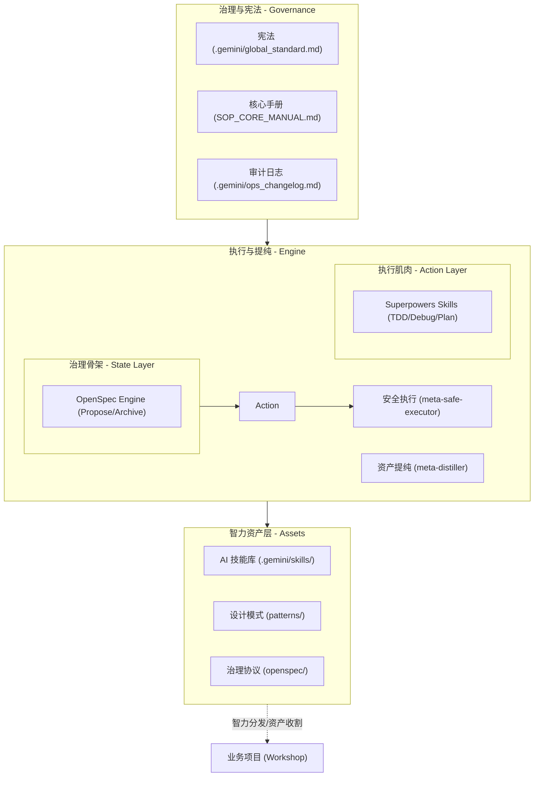
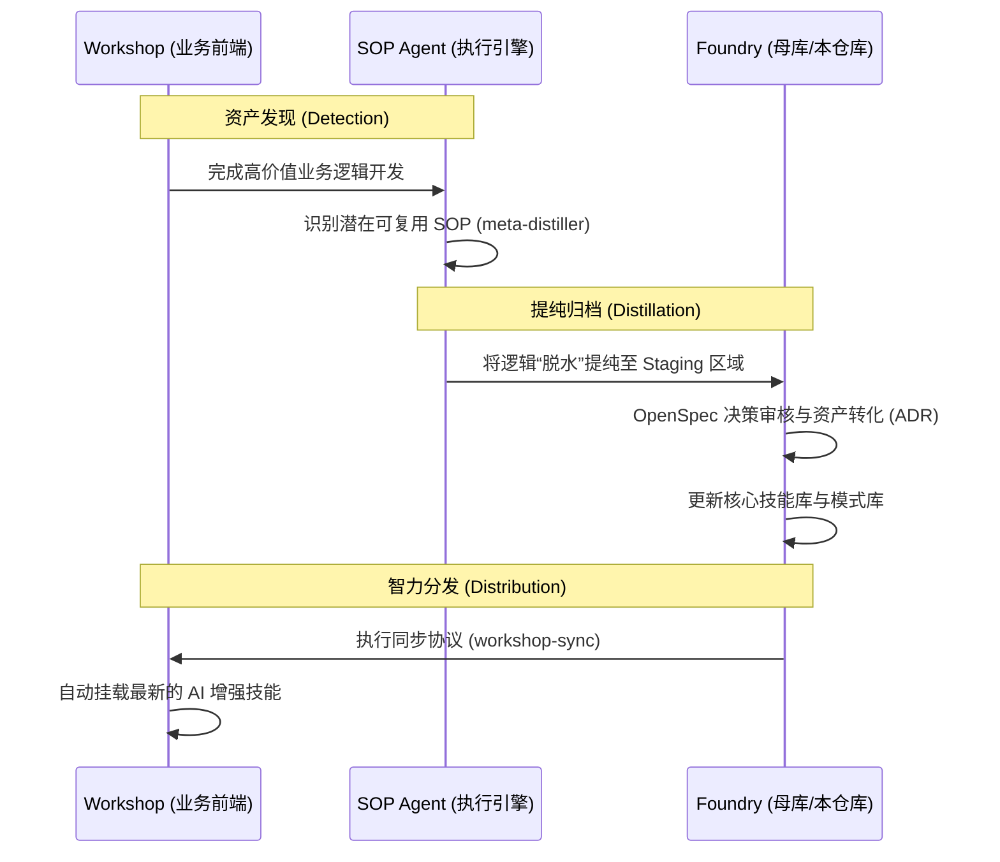
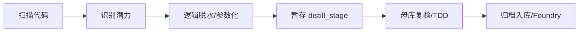
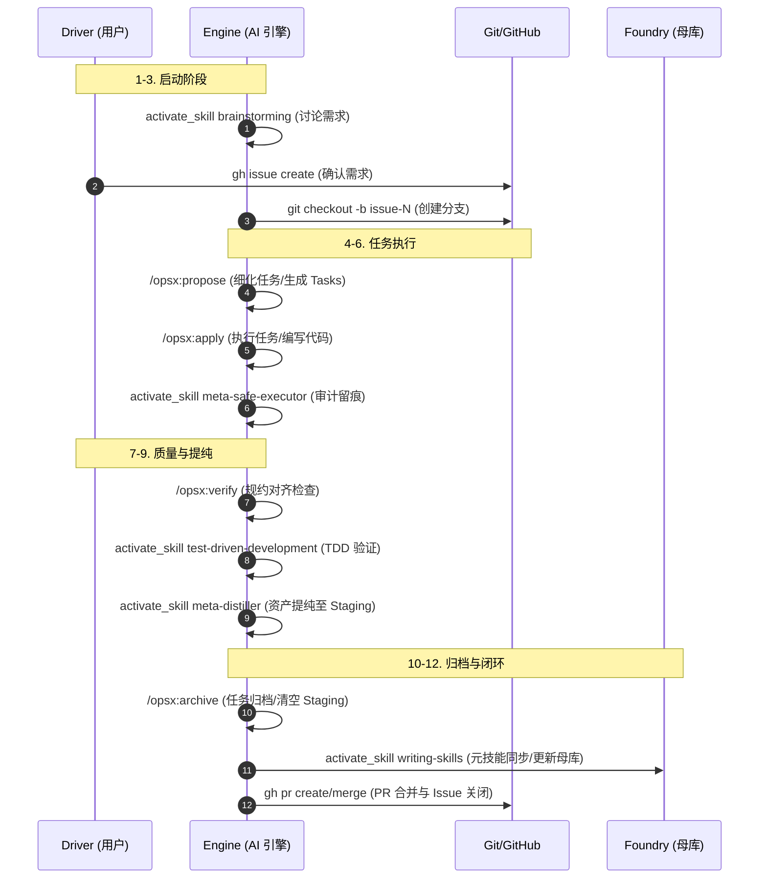

# YOU-DRIVE-SOP 2.0 架构与流程规约 (System Architecture)

本文档定义了 **YOU-DRIVE-SOP 2.0 (智力演进实验室)** 的物理架构设计、智力资产循环流程以及核心执行引擎的二元协作模型。

---

## 1. 逻辑架构图 (Logic Architecture)

该图描述了系统如何组织治理宪法、智力资产库、执行引擎以及外部业务项目（Workshop）之间的物理关系。

---

## 2. 治理与执行的二元关系 (Skeleton-Muscle Model)

为了确保 AI 引擎既具备严谨的流程控制，又具备高效的执行能力，系统采用**“骨架-肌肉”**二元模型：

### 2.1 治理骨架 (Skeleton: OpenSpec)
*   **职责**：管理变更的状态、决策与生命周期。
*   **核心动作**：`/opsx:propose` (提案), `/opsx:apply` (实施), `/opsx:archive` (归档)。
*   **价值**：确保任何非平庸的变更都“有据可查”、“有法可依”。

### 2.2 执行肌肉 (Muscle: Superpowers)
*   **职责**：提供原子级的工程执行技能与铁律。
*   **核心技能**：`writing-plans` (计划驱动), `test-driven-development` (TDD 铁律), `systematic-debugging` (系统化调试)。
*   **价值**：确保每一个原子动作的“物理质量”与“结果可验证性”。

---

## 3. 智力演进生命周期 (Evolution Lifecycle)

### 3.1 宏观循环 (Macro Loop)
描述“业务实践”如何被提炼为“通用资产”并反馈回业务。

### 3.2 微观流程：资产提纯 (Meta-Distiller Flow)
描述逻辑如何从业务代码中剥离并并入母库。

### 3.3 微观流程：12 步生产生命周期 (The 12-Step Protocol)
描述一个任务从 Issue 创建到 PR 合并的完整物理轨迹，确保智力资产在过程中被提取并归档。

> **铁律**：AI 引擎在执行任务时，必须在内心实时对齐这 12 个物理步骤，任何步骤的跳过均被视为对 SOP 2.0 规约的违背。

---

## 4. 核心组件定义

### 治理层 (Governance)
*   **宪法 (.gemini/global_standard.md)**: 定义 AI 引擎的行为边界、审计先行禁令与核心价值观。
*   **核心手册 (SOP_CORE_MANUAL.md)**: [SSOT 迁移中] 详细阐述系统逻辑刚性。

### 智力资产层 (Assets)
*   **Skills (AI 技能库)**: 赋予 AI Agent 的特定工作流指令（如 TDD、系统化调试），实现“授人以渔”。
*   **Patterns (设计模式库)**: 经过验证的代码架构模板（带自动化测试），是智力资产的物理形态。
*   **OpenSpec**: 系统的神经中枢，负责管理技术决策 (ADR)、任务提案 (Propose) 与归档 (Archive)。

### 执行引擎 (Engine)
*   **Meta-Safe-Executor**: 在执行任何物理写操作前执行 Git 快照与安全性审计。
*   **Meta-Distiller**: 专门用于从业务代码中识别、剥离并提纯高价值逻辑的工具。
*   **Superpowers Skills**: 提供 TDD、计划编写、系统调试等“肌肉”层面的工程支持。

---

## 5. 角色定义 (Role Definitions)

### 5.1 实验室管理员 (Foundry Manager)
*   **目标**：维护母库（Foundry）、管理 Skills 与 Patterns，确保智力资产的纯度与普适性。
*   **核心动作**：
    *   执行 `activate_skill foundry-initializing` 补全核心规约。
    *   审核来自各 Workshop 的资产提纯（Distillation）申请。
    *   通过 ADR (Architecture Decision Records) 驱动母库架构演进。

### 5.2 资产收割员 (Workshop Developer)
*   **目标**：在业务项目（Workshop）中引用母库智力，并识别、上报高价值业务逻辑。
*   **核心动作**：
    *   执行 `activate_skill workshop-initializing` 建立物理链路。
    *   遵循 SOP 12 步生产规约执行业务开发。
    *   使用 `meta-distiller` 提纯逻辑并推送到 Staging 区域。

### 5.3 AI 引擎 (SOP Engine)
*   **目标**：在驾驶员（用户）的指引下，严格遵循物理规约执行原子化任务。
*   **核心动作**：
    *   执行 [CRITICAL-BOOT-SEQUENCE] 完成自检。
    *   激活特定 Skill 解决领域问题。
    *   实时记录审计日志（Ops Changelog）。

