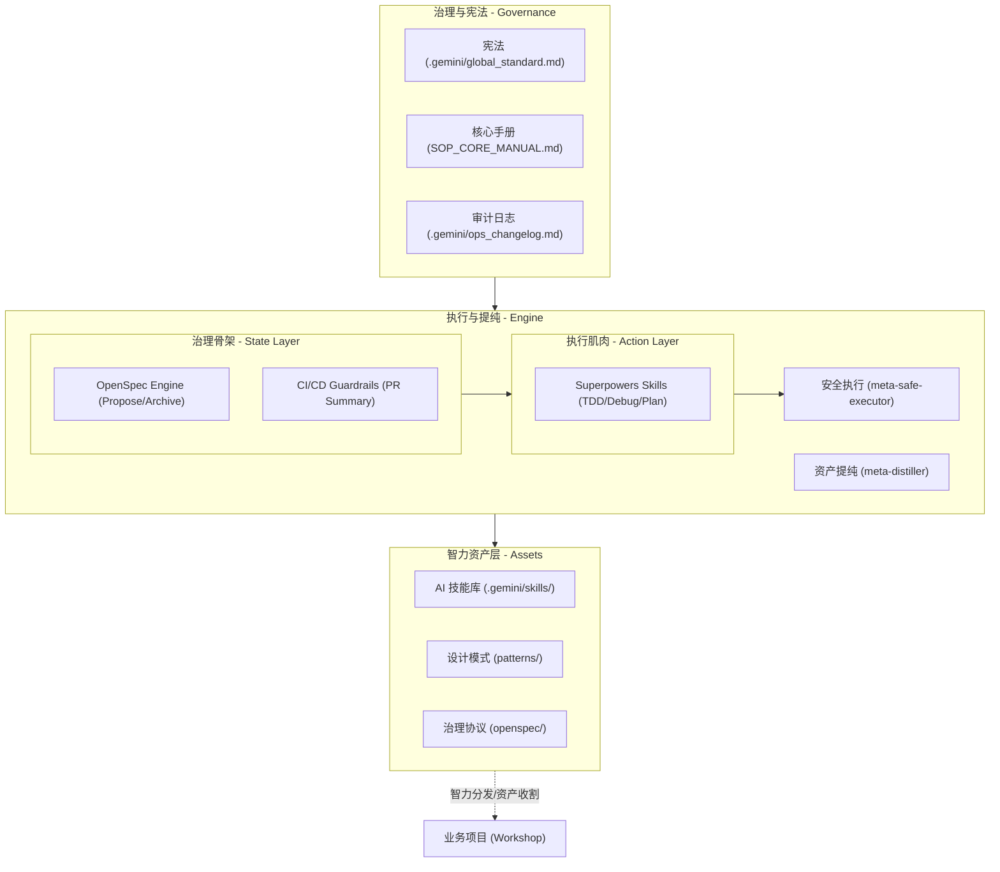
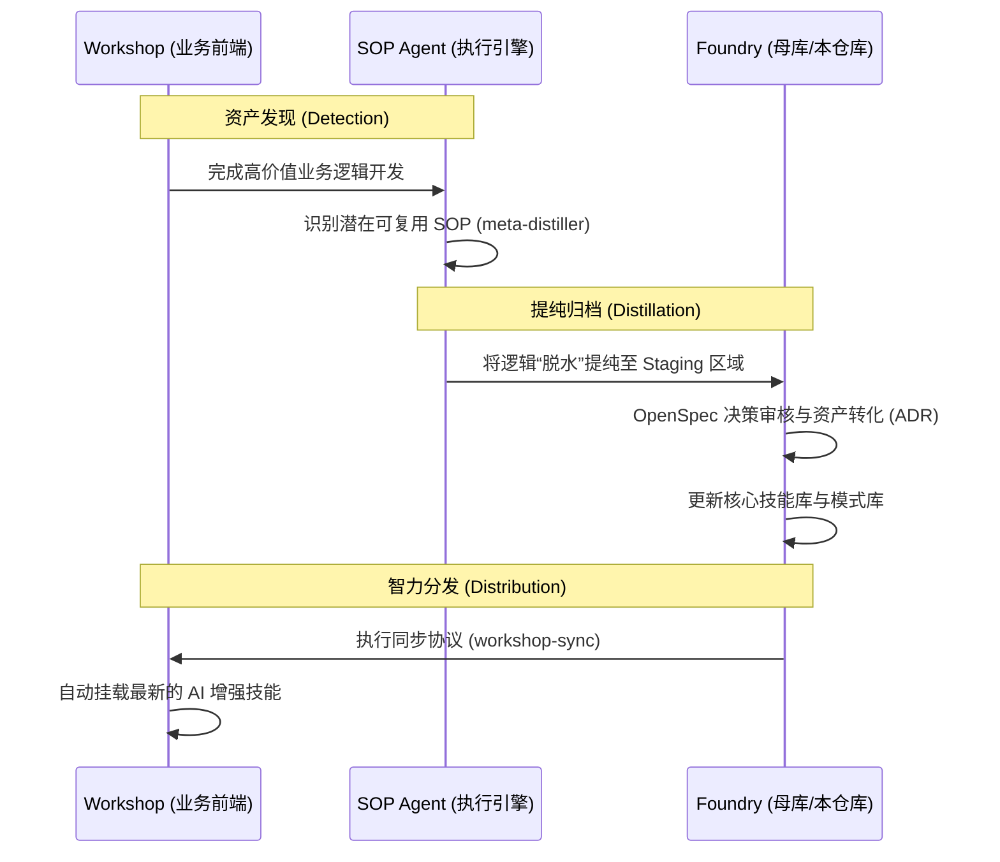
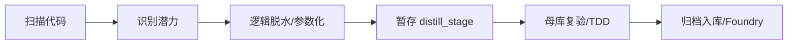
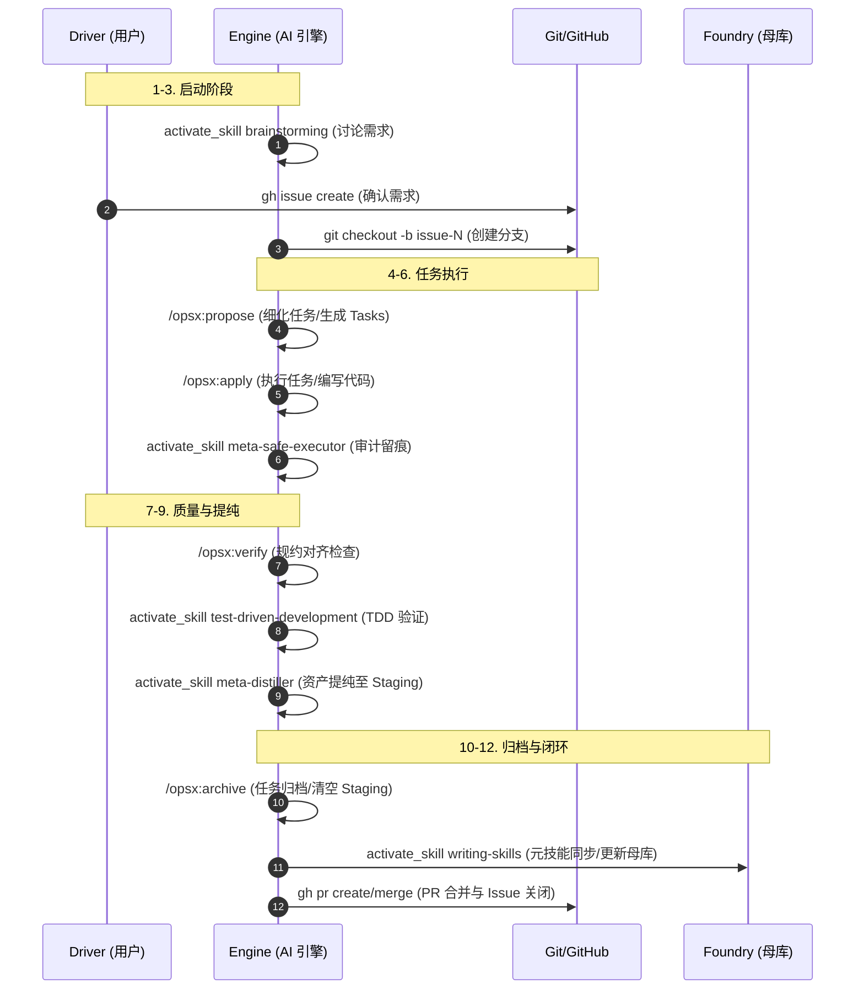

# YOU-DRIVE-SOP 2.0 架构与流程规约 (System Architecture)

本文档定义了 **YOU-DRIVE-SOP 2.0 (智力演进实验室)** 的物理架构设计、智力资产循环流程以及核心执行引擎的二元协作模型。

---

## 1. 逻辑架构图 (Logic Architecture)

该图描述了系统如何组织治理宪法、智力资产库、执行引擎以及外部业务项目（Workshop）之间的物理关系。

---

## 2. 治理与执行的二元关系 (Skeleton-Muscle Model)

为了确保 AI 引擎既具备严谨的流程控制，又具备高效的执行能力，系统采用**“骨架-肌肉”**二元模型：

### 2.1 治理骨架 (Skeleton: OpenSpec + CI)
*   **职责**：管理变更的状态、决策与生命周期，并通过自动化脚本强制执行。
*   **核心动作**：`/opsx:propose` (提案), `/opsx:apply` (实施), `/opsx:archive` (归档)。
*   **自动化守门人**：GitHub Actions (`pr_summary.yml`) 会物理检查每一项 PR 是否已在 `openspec/changes/archive/` 下完成归档。

### 2.2 执行肌肉 (Muscle: Superpowers)
*   **职责**：提供原子级的工程执行技能与铁律。
*   **核心技能**：`writing-plans` (计划驱动), `test-driven-development` (TDD 铁律), `systematic-debugging` (系统化调试)。
*   **价值**：确保每一个原子动作的“物理质量”与“结果可验证性”。

---

## 3. 智力演进生命周期 (Evolution Lifecycle)

### 3.1 宏观循环 (Macro Loop)
描述“业务实践”如何被提炼为“通用资产”并反馈回业务。

### 3.2 微观流程：资产提纯 (Meta-Distiller Flow)
描述逻辑如何从业务代码中剥离并并入母库。

### 3.3 微观流程：12 步生产生命周期 (The 12-Step Protocol)
描述一个任务从 Issue 创建到 PR 合并的完整物理轨迹。

---

## 4. 角色定义 (Role Definitions)

### 4.1 实验室管理员 (Foundry Manager)
*   **目标**：维护母库（Foundry）、管理 Skills 与 Patterns。
*   **自演进模式**：当修改母库自身时，管理员身份重叠为 Workshop Developer，必须通过本地 OpenSpec 流程提交变更。

### 4.2 资产收割员 (Workshop Developer)
*   **目标**：在业务项目中引用母库智力，并识别、上报高价值逻辑。
*   **核心工具**：使用 `meta-distiller` 进行逻辑脱水。

### 4.3 AI 引擎 (SOP Engine)
*   **目标**：在规约框架内执行任务。
*   **强制逻辑**：必须通过 [CRITICAL-BOOT-SEQUENCE] 完成初始化。

---

## 5. 文档导航地图 (Documentation SSOT Map)

为了消除冗余，本项目严格遵守以下文档分工。任何重复定义均应以 `ARCHITECTURE.md` 为准。

| 文件名 | 定位 | 核心内容 |
| :--- | :--- | :--- |
| **README.md** | **门面 (Entrance)** | 项目简介、快速路由、致敬与上游依赖。 |
| **ARCHITECTURE.md** | **真值源 (SSOT)** | **物理架构、二元模型、生命周期流程图、角色定义。** |
| **GETTING_STARTED.md**| **操作 (Operations)** | 环境搭建、12 步协议、递归自演进配置、故障排除。 |
| **GEMINI.md** | **登舰 (Onboarding)** | **AI 启动自检清单 (Boot Sequence)**、快速指令看板。 |
| **SOP_CORE_MANUAL.md**| **哲学 (Philosophy)** | 系统血统、逻辑刚性原则、资产提纯理论。 |
| **global_standard.md** | **宪法 (Constitution)** | 全局禁令、安全锁、审计铁律。 |

---

## 6. 核心组件定义

### 治理层 (Governance)
*   **OpenSpec**: 管理任务生命周期的“骨架”。
*   **CI/CD Guardrails**: GitHub Actions 提供的物理治理强制手段。

### 智力资产层 (Assets)
*   **Skills & Patterns**: 经过提纯的原子知识与代码图纸。

### 执行引擎 (Engine)
*   **Meta-Safe-Executor**: 物理安全与审计层。
*   **Meta-Distiller**: 资产提纯层。
*   **Superpowers**: 工程技能与肌肉层。

---
*YOU-DRIVE-SOP - 驱动规约，掌握智力。*
