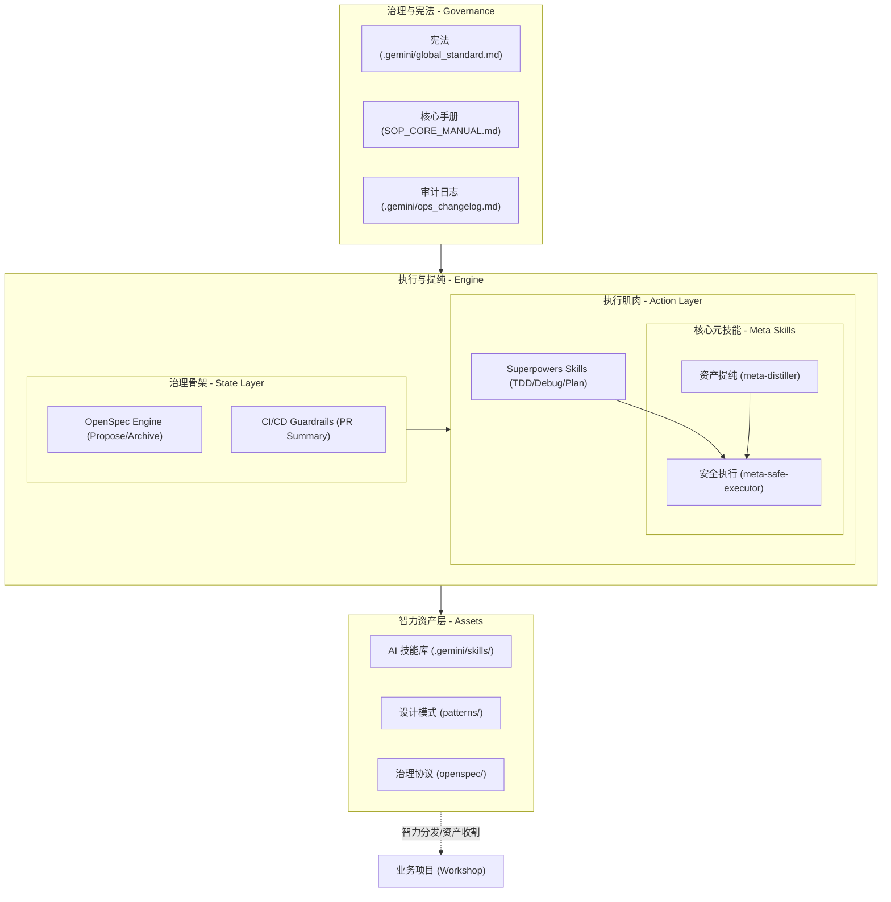
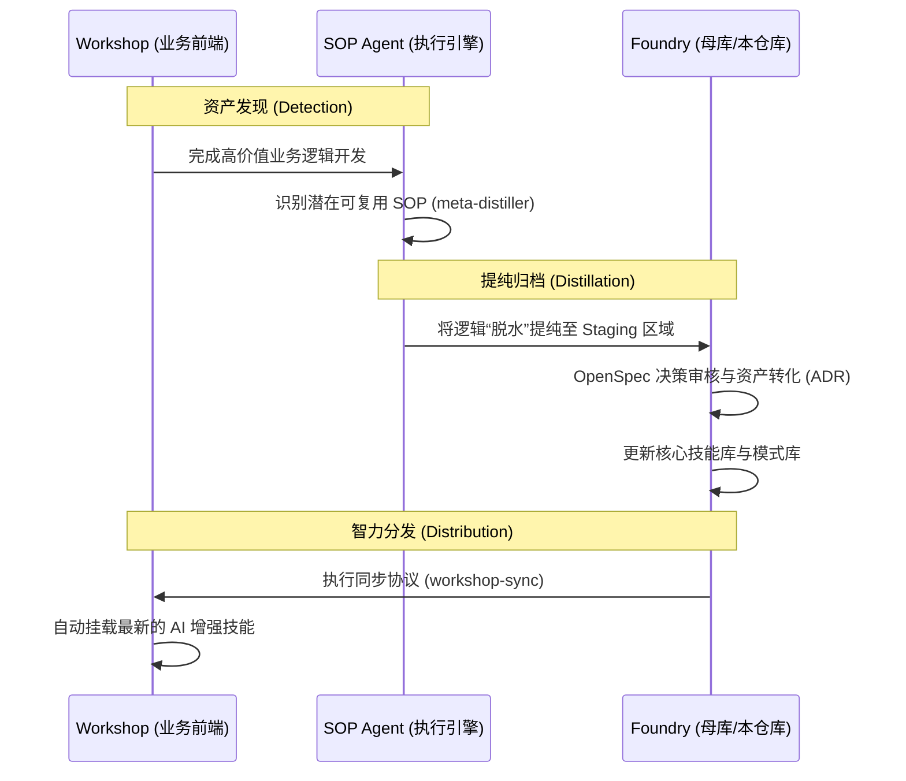
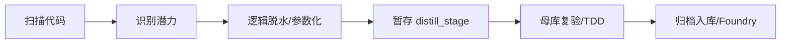
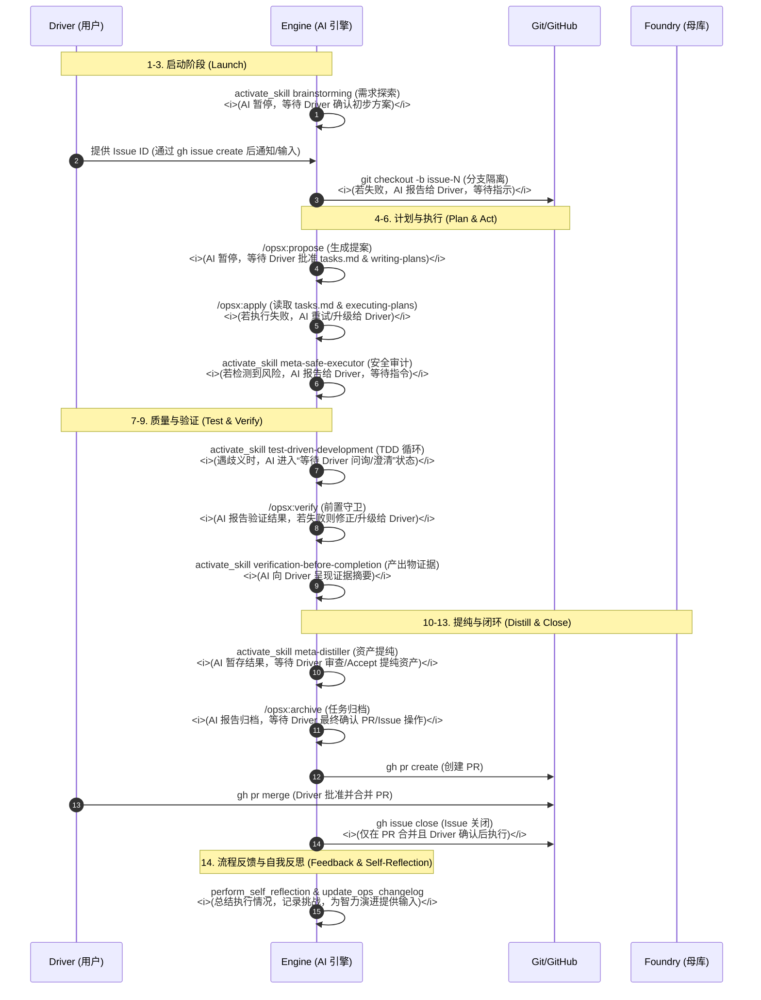

# YOU-DRIVE-SOP 2.0 架构与流程规约 (System Architecture)

本文档定义了 **YOU-DRIVE-SOP 2.0 (智力演进实验室)** 的物理架构设计、智力资产循环流程以及核心执行引擎的二元协作模型。

---

## 1. 逻辑架构图 (Logic Architecture)

该图描述了系统如何组织治理宪法、智力资产库、执行引擎以及外部业务项目（Workshop）之间的物理关系。

---

## 2. 治理与执行的二元关系 (Skeleton-Muscle Model)

为了确保 AI 引擎既具备严谨的流程控制，又具备高效的执行能力，系统采用**“骨架-肌肉”**二元模型：

### 2.1 治理骨架 (Skeleton: OpenSpec + CI)

- **职责**：管理变更的状态、决策与生命周期，并通过自动化脚本强制执行。
- **规划层级**：**治理/策略规划 (Strategic Planning)** —— 决定“去哪 (What & Why)”。
- **核心产出**：Proposal (提案) 与 Specs (规约)。它定义了任务的结构边界。
- **自动化守门人**：GitHub Actions (`pr_summary.yml`) 会物理检查每一项 PR 是否已在 `openspec/changes/archive/` 下完成归档。

### 2.2 执行肌肉 (Muscle: Superpowers)

- **职责**：提供原子级的工程执行技能与铁律。
- **规划层级**：**执行/战术规划 (Tactical Planning)** —— 决定“怎么走 (How)”。
- **核心产出**：Task List (任务清单)。即使是 `writing-plans` 技能，也是为了驱动物理执行而进行的战术协调。
- **核心技能**：`writing-plans`, `test-driven-development` (TDD 铁律), `systematic-debugging` (系统化调试)。

---

## 3. 智力演进生命周期 (Evolution Lifecycle)

### 3.1 宏观循环 (Macro Loop)

描述“业务实践”如何被提炼为“通用资产”并反馈回业务。

### 3.2 微观流程：资产提纯 (Meta-Distiller Flow)

描述逻辑如何从业务代码中剥离并并入母库。

### 3.3 微观流程：13 步生产生命周期 (The 13-Step Protocol) - **优化版**

描述一个任务从需求探索到代码合并的全流程物理轨迹，深度融合 Superpowers 以确保工程质量，并明确人机交互与错误处理。

> **铁律**：AI 引擎执行任务时，必须对齐此优化后的 14 步流程。任何偏离（AI 尝试跳过 Driver 审批、忽视错误升级、或未完成反思）均视为对 SOP 2.0 规约的违背。AI 必须在遇到模糊指令或流程中断时，主动寻求 Driver 的澄清或介入。

---

## 4. 角色定义 (Role Definitions)

### 4.1 实验室管理员 (Foundry Manager)

- **目标**: 维护母库（Foundry）、管理 Skills 与 Patterns。
- **自演进模式**: 当修改母库自身时，管理员身份重叠为 Workshop Developer，必须通过本地 OpenSpec 流程提交变更。

### 4.2 资产收割员 (Workshop Developer)

- **目标**: 在业务项目中引用母库智力，并识别、上报高价值逻辑。
- **核心工具**: 使用 `meta-distiller` 进行逻辑脱水。

### 4.3 AI 引擎 (SOP Engine)

- **目标**: 在规约框架内执行任务，并根据 Driver 的指令进行协作与回退。
- **强制逻辑**: 必须通过 [CRITICAL-BOOT-SEQUENCE] 完成初始化，并在 14 步生命周期内严格遵循 Driver 的审批与指导。

---

## 4. 角色定义 (Role Definitions)

### 4.1 实验室管理员 (Foundry Manager)

- **目标**：维护母库（Foundry）、管理 Skills 与 Patterns。
- **自演进模式**：当修改母库自身时，管理员身份重叠为 Workshop Developer，必须通过本地 OpenSpec 流程提交变更。

### 4.2 资产收割员 (Workshop Developer)

- **目标**：在业务项目中引用母库智力，并识别、上报高价值逻辑。
- **核心工具**：使用 `meta-distiller` 进行逻辑脱水。

### 4.3 AI 引擎 (SOP Engine)

- **目标**：在规约框架内执行任务。
- **强制逻辑**：必须通过 [CRITICAL-BOOT-SEQUENCE] 完成初始化。

---

## 5. 文档导航地图 (Documentation SSOT Map)

为了消除冗余，本项目严格遵守以下文档分工。任何重复定义均应以 `ARCHITECTURE.md` 为准。

| 文件名                 | 定位                    | 核心内容                                            |
| :--------------------- | :---------------------- | :-------------------------------------------------- |
| **README.md**          | **门面 (Entrance)**     | 项目简介、快速路由、致敬与上游依赖。                |
| **ARCHITECTURE.md**    | **真值源 (SSOT)**       | **物理架构、二元模型、生命周期流程图、角色定义。**  |
| **GETTING_STARTED.md** | **操作 (Operations)**   | 环境搭建、12 步协议、递归自演进配置、故障排除。     |
| **GEMINI.md**          | **登舰 (Onboarding)**   | **AI 启动自检清单 (Boot Sequence)**、快速指令看板。 |
| **SOP_CORE_MANUAL.md** | **哲学 (Philosophy)**   | 系统血统、逻辑刚性原则、资产提纯理论。              |
| **global_standard.md** | **宪法 (Constitution)** | 全局禁令、安全锁、审计铁律。                        |

---

## 6. 核心组件定义

### 治理层 (Governance)

- **OpenSpec**: 管理任务生命周期的“骨架”。
- **CI/CD Guardrails**: GitHub Actions 提供的物理治理强制手段。

### 智力资产层 (Assets)

- **Skills & Patterns**: 经过提纯的原子知识与代码图纸。

### 执行引擎 (Engine)

- **Meta-Safe-Executor**: 物理安全与审计层。
- **Meta-Distiller**: 资产提纯层。
- **Superpowers**: 工程技能与肌肉层。

---

_YOU-DRIVE-SOP - 驱动规约，掌握智力。_
