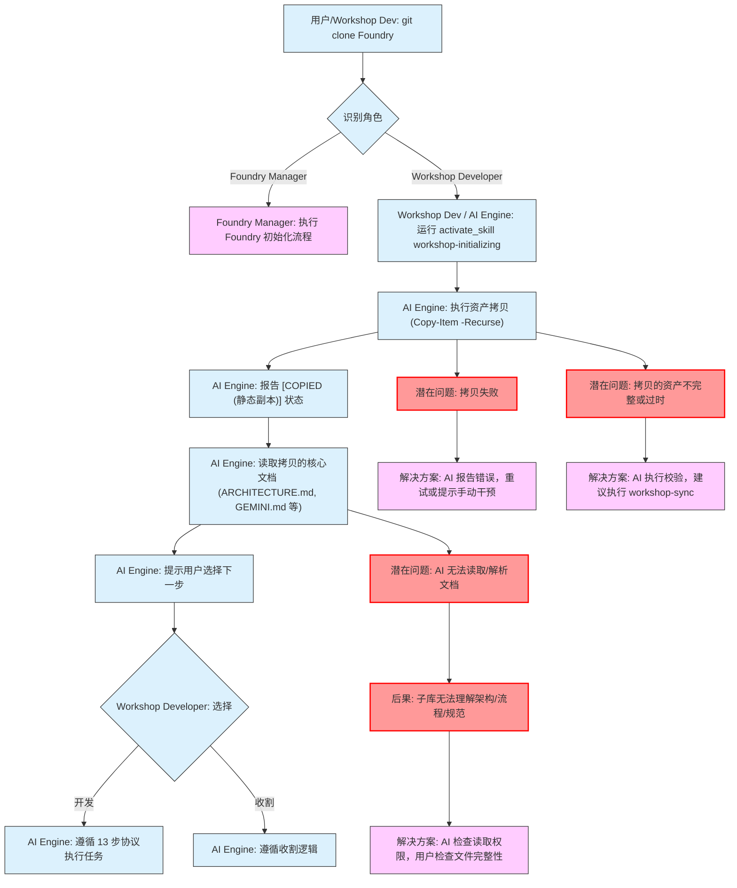

# GETTING STARTED (快速上手)

欢迎来到 YOU-DRIVE-SOP 2.0 的世界！本指南将帮助您快速启动、理解项目运作，并开始贡献。

## 1. 角色识别与环境准备

在开始任何操作之前，请您先确认您在本 SOP 体系中的角色：

- **Foundry Manager (实验室管理员)**: 负责维护母库（Foundry）的核心资产（Skills, Patterns）。
- **Workshop Developer (资产收割员)**: 负责在子库（Workshop）中应用母库资产，并识别、反馈可提炼的逻辑。
- **AI 引擎 (SOP Engine)**: 我将协助您完成大部分任务。

---

## 2. Workshop 初始化流程 (Workshop Initialization Flow)

当您克隆母库（Foundry）后，作为 Workshop Developer，您需要按照以下流程来设置您的子库（Workshop）环境，使其能够正确获取母库的核心资产，并理解项目的架构、流程与规范。

### 2.1 操作流程图 (详细版)

以下流程图详细描绘了从克隆仓库到 Workshop 环境准备就绪的关键步骤，包括具体指令、操作角色以及潜在问题和解决方案：

### 3. 流程详解与问题排查

- **步骤 1: 克隆母库 (User/Workshop Dev)**
  - **指令**: `git clone [Foundry 仓库 URL]`
  - **目的**: 获取母库的完整代码和文档。
- **步骤 2: 识别角色 (User/AI)**
  - **AI 操作**: AI 启动后，会尝试读取 `role.json` (由 `workshop-initializing` 创建) 来识别当前环境的角色。
  - **AI 报告**: `[Foundry]` 或 `[Workshop]`。
- **Foundry Manager 初始化 (Foundry Manager)**
  - **操作**: 遵循母库自身的初始化流程（可能包括运行 `foundry-initializing` 技能）。
- **Workshop Developer 初始化 (Workshop Dev / AI Engine)**
  - **操作**: Workshop Developer 运行 `activate_skill workshop-initializing`。
  - **AI 引擎操作**:
    - **执行资产拷贝**: AI 强制执行 `Copy-Item -Recurse`，将母库核心资产（如 Skills, Patterns, Core Docs）复制到 Workshop 的工作区内。
    - **状态报告**: AI 报告 `[COPIED (静态副本)]` 状态。
- **核心文档读取 (AI Engine)**
  - **操作**: AI 尝试读取拷贝过来的核心文档（如 `ARCHITECTURE.md`, `GEMINI.md` 等）。
  - **目的**: 使 AI 能够理解项目的架构、流程和规范。
- **AI 提示用户选择 (AI Engine)**
  - **AI 操作**: 根据初始化结果，AI 提示用户下一步操作：“开始收割 (Scan)” 或 “开发 (Develop)”。
- **用户选择 (Workshop Developer)**
  - **操作**: 用户根据项目需求选择“收割”或“开发”。
- **后续流程**:
  - **开发**: AI 遵循“13 步协议”执行开发任务。
  - **收割**: AI 遵循扫描逻辑，识别可提炼的逻辑。

### 4. 潜在问题与解决方案

- **Z1: 拷贝失败 (AI 执行资产拷贝时)**
  - **问题**: AI 报告拷贝失败。
  - **原因**: 可能是由于目标目录不存在、权限不足、磁盘空间不足、网络中断等。
  - **解决方案**: AI 报告具体错误信息；用户检查环境（权限、磁盘空间、网络）；AI 尝试重试，或用户需手动干预（例如，手动创建目录、清理空间）。
- **Z3: AI 无法读取/解析文档 (AI 读取核心文档时)**
  - **问题**: AI 报告无法读取或解析已拷贝的核心文档。
  - **原因**: AI 在其工作区内对已拷贝的核心文档没有读取权限；文件编码格式错误；文件损坏。
  - **解决方案**: AI 检查工作区内对核心文档的读取权限；确保文件格式无误；用户检查文件完整性（例如，重新执行拷贝）。
- **Z5: 拷贝的资产不完整或过时 (AI 执行资产拷贝后)**
  - **问题**: 尽管拷贝报告成功，但发现资产不完整或不是最新版本。
  - **原因**: 拷贝过程可能因某些原因中断；母库更新后子库未及时同步。
  - **解决方案**: AI 需执行文件校验。若发现问题，建议用户确认母库的最新状态，并可能需要手动执行 `workshop-sync` 命令来拉取更新。
