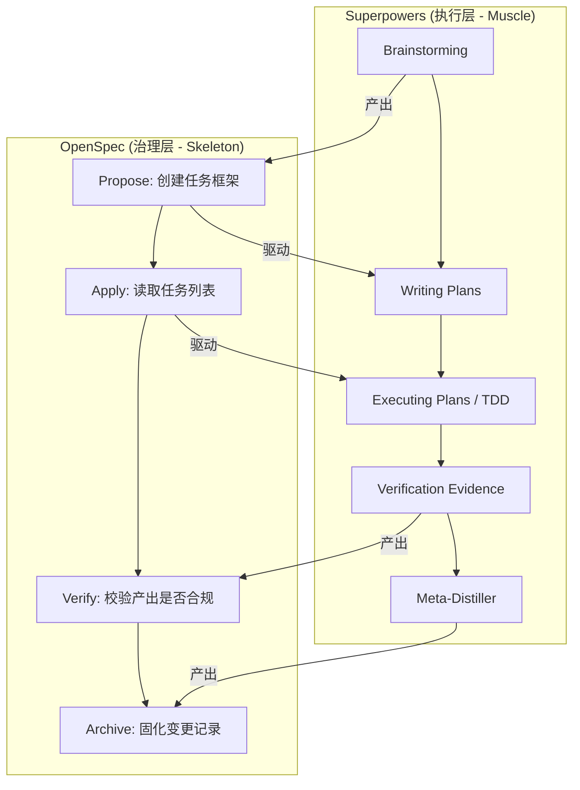
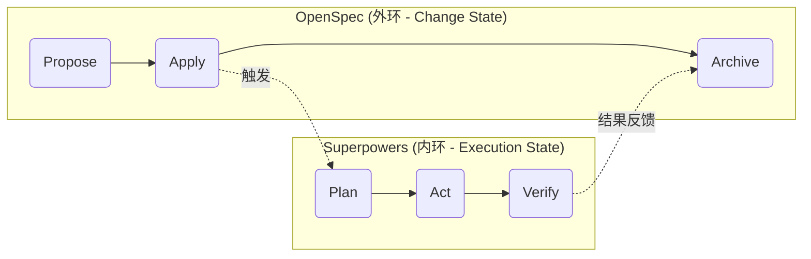

# OpenSpec vs. Superpowers 深度对比分析

本文档用于实时记录对 OpenSpec 与 Superpowers 进行深度对比研究的过程与结论，旨在最终形成 SOP 2.0 的“第一性原理”文档。

---

## 阶段 1：哲学与愿景 (Philosophy & Vision)

| 维度 | OpenSpec (骨架) | Superpowers (肌肉) |
| :--- | :--- | :--- |
| **核心问题** | AI 会“随心所欲”地修改代码，导致结果**不可预测**、过程**不可追溯**。 | AI 知道“做什么”，但不知道“怎么做才对”，缺乏领域**最佳实践**和**工程纪律**。 |
| **解决方案** | **变更驱动开发 (Change-Driven)** | **提示工程库 (Prompt Engineering Library)** |
| **创世哲学** | 先对齐，再执行。在人和 AI 对“要做的变更”达成物理共识（`proposal`, `specs`）之前，**一行代码都不写**。 | 知识可以被结构化为可复用的 Prompt。通过 `activate_skill`，AI 可以动态加载专家知识，**模仿**最佳实践。 |
| **目标用户** | **项目治理者**（确保项目不失控） | **AI 工程师 / AI 自身**（确保动作质量） |

---

## 阶段 2：范围与边界 (Scope & Boundary)

| 阶段 (12步协议) | OpenSpec (骨架) 负责 | Superpowers (肌肉) 负责 | 边界交互点 |
| :--- | :--- | :--- | :--- |
| **1-3. 启动** | - | `brainstorming` (讨论需求) | `brainstorming` 的产出是 `/opsx:propose` 的输入。 |
| **4. 细化任务** | `/opsx:propose` (创建 Change 目录) | `writing-plans` (填充 `tasks.md`) | OpenSpec 创建了 `tasks.md` 的空壳，Superpowers 负责填肉。 |
| **5. 执行任务** | `/opsx:apply` (读取 `tasks.md`) | `executing-plans`, `TDD`, 等 (执行具体代码修改) | OpenSpec 提供了“要执行什么”，Superpowers 提供了“如何执行”。 |
| **6-8. 验证** | `/opsx:verify` (比对 `specs.md`) | `verification-before-completion` (提供证据) | Superpowers 产生物理证据（如测试结果），OpenSpec 负责比对。 |
| **9-11. 归档** | `/opsx:archive` (移动目录) | `meta-distiller`, `writing-skills` (提纯资产) | Superpowers 负责在归档前“准备好”可复用的资产。 |
| **12. 闭环** | - | - | 共同驱动 PR 与 Issue 的关闭。 |

#### 责任边界图 (Mermaid)

---

## 阶段 3：机制与实现 (Mechanism & Implementation)

| 维度 | OpenSpec (骨架) | Superpowers (肌肉) |
| :--- | :--- | :--- |
| **交互入口** | CLI 命令 (`/opsx:...`) | 工具调用 (`activate_skill`) |
| **核心机制** | **文件系统驱动**。通过创建、修改、移动目录 (`openspec/changes/...`) 和文件 (`.openspec.yaml`, `tasks.md`) 来管理状态。 | **Prompt 注入驱动**。通过读取 `.md` 文件并将其注入上下文，来“指导”AI 的下一步思考和行为。 |
| **状态持久化** | **强持久化**。所有状态都以物理文件的形式存在于硬盘上，跨会话、跨用户共享。 | **弱持久化 / 易失性**。技能的效果仅存在于当前会话的上下文中。`write_todos` 的状态在会话结束后通常会丢失。 |
| **对 AI 的影响** | **结构性约束**。AI 无法绕过文件系统施加的物理状态。 | **行为性引导**。AI 在理论上可以“违背”技能的指导，尽管这通常被宪法禁止。 |

---

## 阶段 4：集成模式 (Integration Pattern)

| 维度 | 集成模式 |
| :--- | :--- |
| **数据流** | OpenSpec 的 `proposal.md` 和 `specs.md` **驱动** Superpowers `writing-plans` 技能的输入；Superpowers `executing-plans` 技能的物理产出（代码、测试报告）是 OpenSpec `/opsx:verify` 阶段的**验证对象**。 |
| **状态同步** | **单向驱动，无需同步**。OpenSpec 作为外环，其状态（如“已归档”）是最终状态。Superpowers 的内环状态（如“`write_todos` 已完成”）服务于外环，一旦外环状态变更（如任务完成），内环状态即失效。这解决了双向同步的复杂性。 |
| **错误处理** | 如果 Superpowers 执行失败（如 TDD 不通过），它将阻塞 OpenSpec `apply` 阶段的前进，但不会改变 OpenSpec 的状态。操作员必须修复“肌肉”问题，才能继续推动“骨架”前进。 |
| **调用关系** | **明确的嵌套调用**：`用户 -> /opsx:apply -> AI -> activate_skill 'executing-plans'`。 |

#### 集成模式图 (Mermaid)

*注：Apply 阶段触发了 Superpowers 的内环执行，内环的最终产出（代码）被 Archive 阶段固化。*
